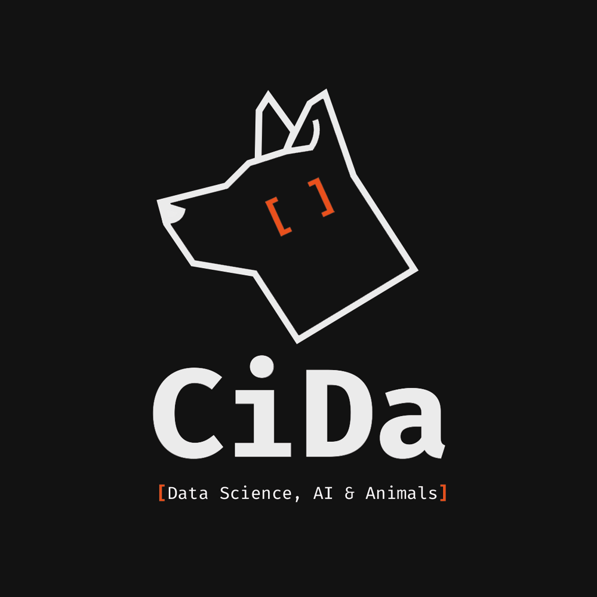

  

<h1 align="center">CiDa — Ciência de Dados, IA e Animais</h1>

  <b>Grupo de Estudos e Pesquisa da Escola de Veterinária — UFMG</b> 
  <i>Inovação tecnológica, inteligência artificial e análise de dados aplicadas à saúde animal e medicina veterinária.</i>

<!-- 

  
  
  
   

 */ -->
